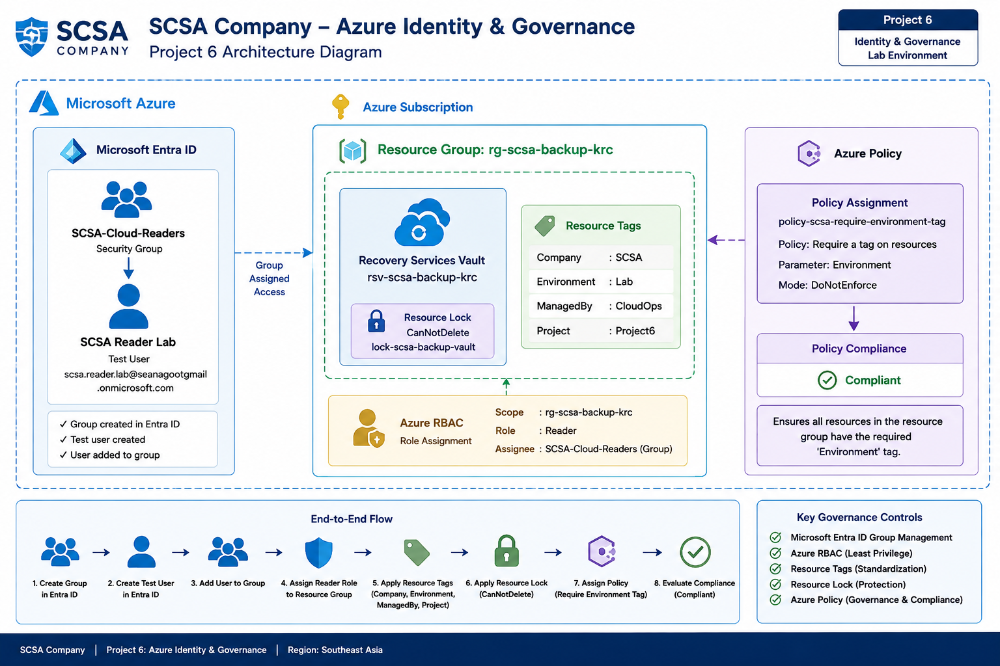

# SCSA Company – Project 6: Azure Identity, RBAC and Governance

## Project Overview

This project implements identity, access control, and governance controls for the SCSA Company Azure environment.

The objective was to strengthen administrative control over existing Azure resources by using:

- Microsoft Entra ID
- Security groups
- Azure Role-Based Access Control (RBAC)
- Resource tags
- Resource locks
- Azure Policy
- Policy compliance evaluation

The project demonstrates how Azure administrators can control who has access to resources, organize resources consistently, protect critical infrastructure from accidental deletion, and evaluate governance compliance.

---

## Business Scenario

SCSA Company has expanded its Azure environment through previous projects involving:

- Networking
- Compute
- Storage
- Monitoring
- Backup and recovery

As the environment grows, SCSA needs stronger governance controls.

The company requires a solution that can:

- Manage access through centralized identity groups
- Apply least-privilege permissions
- Standardize resource metadata
- Protect critical backup infrastructure from accidental deletion
- Enforce or evaluate governance requirements
- Detect non-compliant resources
- Validate remediation after configuration changes

This project introduces an identity and governance baseline for the SCSA Azure environment.

---

## Architecture

The project architecture includes:

- Microsoft Entra ID
- `SCSA-Cloud-Readers` security group
- `SCSA Reader Lab` test user
- Azure RBAC Reader assignment
- Resource tags
- `CanNotDelete` resource lock
- Azure Policy assignment
- Policy compliance evaluation

---

## Identity and Access Design

Microsoft Entra ID was used as the identity platform for the project.

The access model follows this structure:

`User → Security Group → Azure RBAC Role → Resource Group`

This approach avoids assigning permissions directly to individual users.

Instead, permissions are assigned to a group, and users receive access through group membership.

This provides a more scalable and maintainable access-management model.

---

## Microsoft Entra Security Group

The following Microsoft Entra security group was created:

`SCSA-Cloud-Readers`

The group is intended for identities that require read-only access to selected SCSA Azure resources.

Using a security group allows administrators to manage access by changing group membership instead of creating separate RBAC assignments for every individual user.

---

## Test User

A lab user was created:

`SCSA Reader Lab`

The test account was added to:

`SCSA-Cloud-Readers`

No credentials or passwords are stored in this repository.

The user account exists only to demonstrate group-based identity and access management.

---

## Group Membership

The test user was successfully added to the `SCSA-Cloud-Readers` group.

The access chain therefore became:

`SCSA Reader Lab → SCSA-Cloud-Readers`

This demonstrates how Microsoft Entra group membership can be combined with Azure RBAC.

---

## Azure RBAC

Azure Role-Based Access Control was used to authorize access to SCSA resources.

The following assignment was created:

| Setting | Value |
|---|---|
| Principal | SCSA-Cloud-Readers |
| Role | Reader |
| Scope | rg-scsa-backup-krc |

The role was assigned to the security group rather than directly to the test user.

Members of the group therefore inherit the Reader permission at the resource-group scope.

---

## Least Privilege

The project follows the principle of least privilege.

Instead of assigning permissions at the subscription level, the Reader role was limited to:

`rg-scsa-backup-krc`

This means the group receives only the access required for the targeted SCSA resource group.

The Reader role allows users to view Azure resources but does not allow them to create, modify, or delete resources.

---

## Azure RBAC Scope

Azure RBAC permissions can be assigned at different scopes.

The general hierarchy is:

`Management Group → Subscription → Resource Group → Resource`

Permissions assigned at a higher scope are generally inherited by resources beneath that scope.

In this project, the role assignment was intentionally applied at the resource-group level to reduce unnecessary access.

---

## Resource Tags

Standardized resource tags were applied to the SCSA backup resource group.

Tag configuration:

| Tag | Value |
|---|---|
| Company | SCSA |
| Environment | Lab |
| ManagedBy | CloudOps |
| Project | Project6 |

Tags provide metadata that can be used for:

- Resource organization
- Cost reporting
- Filtering
- Automation
- Governance
- Operational ownership

Tags do not provide security by themselves.

---

## Resource Lock

The Recovery Services Vault was protected with a resource lock.

Resource:

`rsv-scsa-backup-krc`

Lock:

`lock-scsa-backup-vault`

Lock type:

`CanNotDelete`

A `CanNotDelete` lock prevents the protected resource from being deleted while still allowing administrators to modify it.

This provides protection against accidental deletion of critical backup infrastructure.

---

## CanNotDelete vs ReadOnly

Azure supports different resource lock types.

### CanNotDelete

Resources can be modified but cannot be deleted.

### ReadOnly

Resources cannot be modified or deleted through management-plane operations.

For this project, `CanNotDelete` was selected because SCSA still needs to manage the Recovery Services Vault while protecting it from accidental deletion.

---

## Azure Policy

Azure Policy was used to evaluate governance compliance.

The built-in policy:

`Require a tag on resources`

was assigned to:

`rg-scsa-backup-krc`

The required tag was:

`Environment`

The policy assignment was named:

`policy-scsa-require-environment-tag`

---

## Policy Enforcement Mode

The policy assignment used:

`DoNotEnforce`

This allowed Azure Policy to evaluate resource compliance without blocking resource operations.

This was selected for the lab so that policy behavior could be demonstrated safely without interrupting existing SCSA resources.

---

## Policy Non-Compliance Detection

After the policy assignment was evaluated, the Recovery Services Vault was reported as:

`NonCompliant`

The resource group already contained:

`Environment = Lab`

However, the Recovery Services Vault itself did not contain the required `Environment` tag.

This demonstrated an important Azure behavior:

> Tags applied to a resource group do not automatically inherit to individual resources unless additional governance mechanisms are used.

Azure Policy successfully detected the missing tag.

---

## Policy Remediation

The missing tag was added directly to:

`rsv-scsa-backup-krc`

The required tag was:

`Environment = Lab`

After the resource was updated, a new Azure Policy compliance scan was triggered.

---

## Policy Compliance Validation

After re-evaluation, the Recovery Services Vault changed from:

`NonCompliant`

to:

`Compliant`

The full governance lifecycle demonstrated was:

`Policy Assignment → Evaluation → Non-Compliance Detection → Remediation → Re-Evaluation → Compliance`

This provided practical experience with Azure Policy compliance monitoring.

---

## RBAC vs Azure Policy

Azure RBAC and Azure Policy solve different governance problems.

### Azure RBAC

Answers:

> Who is allowed to perform an action?

Example:

`SCSA-Cloud-Readers → Reader → rg-scsa-backup-krc`

### Azure Policy

Answers:

> Is the resource configuration compliant with organizational requirements?

Example:

`Resources must contain the Environment tag.`

A user may have permission through RBAC to create or modify a resource while Azure Policy can still evaluate or restrict whether the configuration is allowed.

---

## Microsoft Entra ID vs Azure RBAC

Microsoft Entra ID manages identities such as:

- Users
- Groups
- Service principals
- Managed identities

Azure RBAC manages authorization to Azure resources.

The simplified distinction is:

`Microsoft Entra ID = Who are you?`

`Azure RBAC = What are you allowed to do?`

---

## Governance Controls

Project 6 implemented four major Azure governance controls.

### RBAC

Controls who can access Azure resources and what actions they can perform.

### Tags

Provide resource classification and metadata.

### Resource Locks

Protect important Azure resources from accidental modification or deletion depending on lock type.

### Azure Policy

Evaluates or enforces organizational configuration requirements.

---

## Final Validation

The final validation confirmed:

| Control | Result |
|---|---|
| RBAC Role | Reader |
| Company Tag | SCSA |
| Environment Tag | Lab |
| ManagedBy Tag | CloudOps |
| Project Tag | Project6 |
| Resource Lock | CanNotDelete |
| Policy Compliance | Compliant |

This confirmed that the SCSA governance configuration was operating as intended.

---

## Troubleshooting

### Multiline Azure CLI Command Formatting

The initial Microsoft Entra user creation command failed because the Bash line-continuation characters were followed by spaces and blank lines.

The shell interpreted the remaining parameters as separate commands.

The issue was resolved by ensuring that each backslash was the final character on the line or by running the command as a single line.

---

### Azure Policy Definition Lookup

The built-in policy definition was initially passed to the policy assignment command using its provider-scoped resource ID.

The installed Azure CLI version returned:

`PolicyDefinitionNotFound`

The issue was resolved by retrieving the policy definition's `name` value and passing the policy definition GUID directly to the assignment command.

---

### Policy Compliance Initially Reported NonCompliant

The Recovery Services Vault was initially reported as non-compliant because the `Environment` tag existed only on the resource group.

Resource-group tags did not automatically propagate to the Recovery Services Vault.

The required tag was added directly to the vault and policy compliance was re-evaluated.

---

### Recovery Services Vault Tag Update

An initial attempt to modify the vault using a generic resource update command returned:

`InvalidRestApiParameter`

The tag was successfully added using Azure's dedicated tag management command with a merge operation.

This preserved the resource while updating its metadata safely.

---

## Security Design

The governance model uses several security and operational principles:

- Group-based access management
- Least-privilege RBAC scope
- Reader access instead of modification privileges
- No credentials stored in repository scripts
- Resource deletion protection
- Policy-based governance
- Compliance validation
- Sanitized screenshots without subscription IDs where possible

The test user is used only for lab validation and does not represent a production identity.

---

## Implementation

The project was implemented primarily using Azure CLI.

### Deployment Scripts

- [01-entra-group.sh](./scripts/01-entra-group.sh) – Creates the SCSA Entra security group.
- [02-entra-test-user.sh](./scripts/02-entra-test-user.sh) – Creates the lab user using a password placeholder.
- [03-group-membership.sh](./scripts/03-group-membership.sh) – Adds the test user to the security group.
- [04-rbac-reader-assignment.sh](./scripts/04-rbac-reader-assignment.sh) – Assigns the Reader role to the security group at resource-group scope.
- [05-resource-tags.sh](./scripts/05-resource-tags.sh) – Applies standardized SCSA governance tags.
- [06-resource-lock.sh](./scripts/06-resource-lock.sh) – Applies a CanNotDelete lock to the Recovery Services Vault.
- [07-policy-assignment.sh](./scripts/07-policy-assignment.sh) – Assigns the required Environment tag policy.
- [08-policy-compliance.sh](./scripts/08-policy-compliance.sh) – Triggers and reviews policy compliance evaluation.
- [09-final-validation.sh](./scripts/09-final-validation.sh) – Validates RBAC, tags, locks, and policy compliance.

---

## Implementation Evidence

Screenshots are available in the [`screenshots`](./screenshots/) directory.

Evidence includes:

1. Microsoft Entra security group
2. Entra test user
3. Group membership
4. Reader RBAC assignment
5. Resource tags
6. CanNotDelete resource lock
7. Azure Policy assignment
8. Policy non-compliance detection
9. Policy compliance after remediation
10. Final governance validation

---

## Skills Demonstrated

- Microsoft Entra ID
- Entra Users
- Entra Security Groups
- Group Membership Management
- Azure RBAC
- Built-in Azure Roles
- RBAC Scope
- Least Privilege
- Resource Tags
- Resource Locks
- CanNotDelete Locks
- Azure Policy
- Built-in Policy Definitions
- Policy Assignments
- Policy Parameters
- Policy Compliance
- Governance Remediation
- Azure Resource Providers
- Azure CLI
- Azure Resource Management
- Identity and Access Management
- Cloud Governance
- Security Administration
- Infrastructure Documentation

---

## Project Status

**Completed**

SCSA Company now has an Azure identity and governance baseline that combines Microsoft Entra ID, group-based RBAC, standardized resource tags, deletion protection, and Azure Policy compliance.

This project extends the SCSA Azure environment beyond infrastructure deployment and introduces administrative controls for access management, resource organization, protection, and governance.
